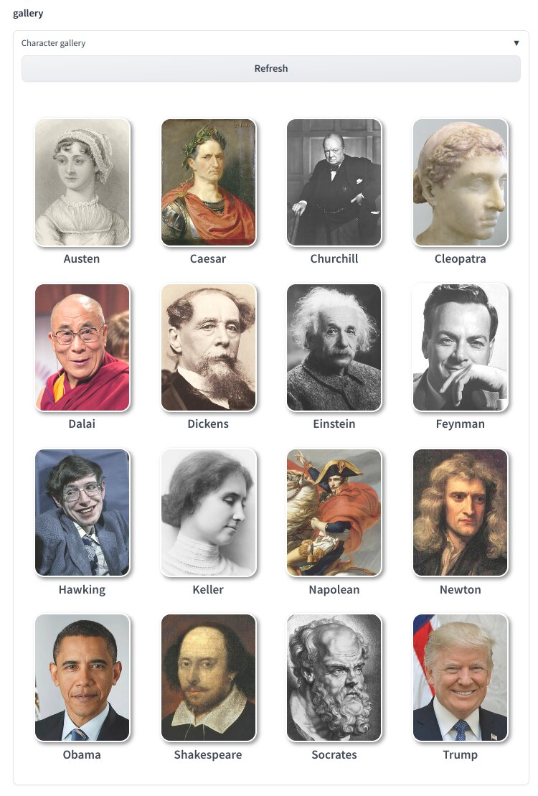

Character Package for Oobabooga Text-Generation-Webui
=====================================================

Just put the content under `characters` into the `characters` directory
of Oobabooga WebUI source directory.

I asked ChatGPT to generate sample conversations with these famous
people to initialize their personality.

